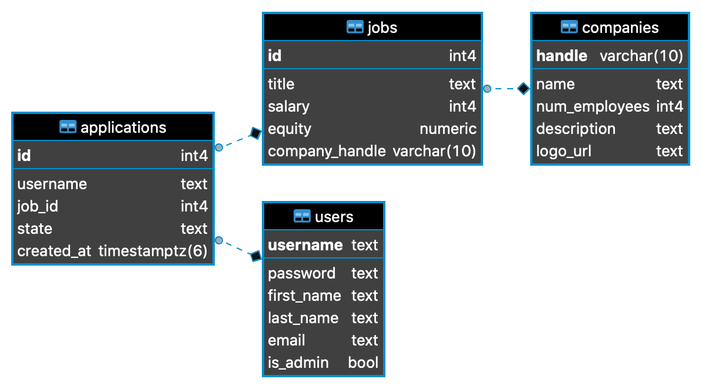

# **Express Jobly**

## **Overview**

A full stack web application called Jobly, which will be used to explore and "apply" for jobs online (no, these won't be REAL jobs). The purpose is to practice Node, Express, and PostgreSQL with relationships using “Jobly”, a job searching API.

Go step by step, first building off of the back-end we provide, creating an API, modeling jobs and users in the database, and finally adding authentication

## **Requirements**

- This is a pure API app, taking values from the query string (GET requests) or from a JSON body (other requests). It returns JSON.
- This gets authentication/authorization with JWT tokens. Make sure your additions only allow access as specified in our requirements.
- Model tests check the underlying database actions. Route tests check the underlying model methods and do not rely directly on the database changes. This is a useful testing design consideration and you should continue it.

#### **Schema**

[](db_diag.png)

## **Technologies Used:**

- [Node.js](https://nodejs.org/en/)
- [PostgreSQL](https://node-postgres.com)
- [Express](https://expressjs.com/en/4x/api.html)
- [Node-Bcrypt](https://www.npmjs.com/package/bcrypt/)
- [Body Parser](https://www.npmjs.com/package/body-parser)
- [JSON Schema](https://json-schema.org)
- [Jest](https://jestjs.io)
- [Supertest](https://www.npmjs.com/package/supertest)
- [Morgan](https://www.npmjs.com/package/morgan)
- [VSCode](https://code.visualstudio.com/docs)

## **How to Run**

This is the Express backend for Jobly.
To run this:

```bash
# Clone Repository
$ git clone https://github.com/cng008/37_express-jobly.git
$ npm install
$ createdb jobly
$ psql < jobly.sql
$ node server.js
open http://localhost:3000/ with API viewer such as Postman or Insomnia
```

Tests are run using Jest and Supertest. Make sure Jest is installed globally.
To run the tests in order:

    jest -i
